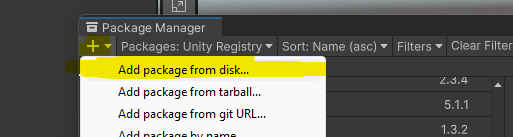

# Generate the Unity Package

The Unity package associated to `InteropUnityCUDA` can be generated in two ways: 

## Manually generation

First, if you want the last version of the code, you need to generate the project and compile it for that [see the dedicated documentation here.](Readme.md). Then, you need to copy the results of this compilation in the unity folder:
```
[ParentOfInteropUnityCUDA]\InteropUnityCUDA\Plugin\build\Debug ---> [ParentOfInteropUnityCUDA]\InteropUnityCUDA\InteropUnityCUDA\Assets\Runtime\Plugin\Debug
[ParentOfInteropUnityCUDA]\InteropUnityCUDA\Plugin\build\Release ---> [ParentOfInteropUnityCUDA]\InteropUnityCUDA\InteropUnityCUDA\Assets\Runtime\Plugin\Release
``` 

Then once it's done create a folder that will contains the package and named it in that way:

```
com.studio-nyx.interop-unity-cuda.<version_number>
```

replace the `<version_number>` by the actual version number of the Unity package.


In this new folder create a json file named `package.json` and write this content inside (once again replace the `<version_number>`: 

```json
{
    "keywords": [
        "GPU",
        "CUDA",
        "OpenGL",
        "DX11",
        "Native-Plugin",
        "interoperability"
    ],
    "license": "MIT",
    "displayName": "Interop Unity CUDA",
    "name": "com.studio-nyx.interop-unity-cuda",
    "description": "Demonstrate interoperability between Unity Engine and CUDA.",
    "version": "<version-number>",
    "author": {
        "email": "david.algis@tutamail.com",
        "url": "https://github.com/davidAlgis",
        "name": "David Algis"
    },
    "dependencies": {
        "com.unity.mathematics": "1.2.6"
    },
    "unity": "2021.1"
}
```

Finally, copy all the content of the asset folder (`[ParentOfInteropUnityCUDA]\InteropUnityCUDA\InteropUnityCUDA\Assets\**`) to the new folder that contains the `package.json`.

## Automatic generation

This will only works on windows system (use manually generation describe above if you're not on windows).

Execute the following script in this order:
1. `.\configureProjects.ps1`
2. `.\compileProjects.ps1 -configuration "release"`
3. `.\compileProjects.ps1 -configuration "debug"`
4. `.\packageUnity.ps1`

## Add the package to a Unity Project

To add the package in a Unity project :
1. Open the project.
2. Click on `Windows\Package Manager`.
3. Click in the new windows on top left button `+`.
4. Click on `Add Package From Disk...`.

5. Select the `package.json` you have created before (with automatic generation it's located in `[ParentOfInteropUnityCUDA]\InteropUnityCUDA\Plugin\buildtools\com.studio-nyx.interop-unity-cuda.1.0.1`).

